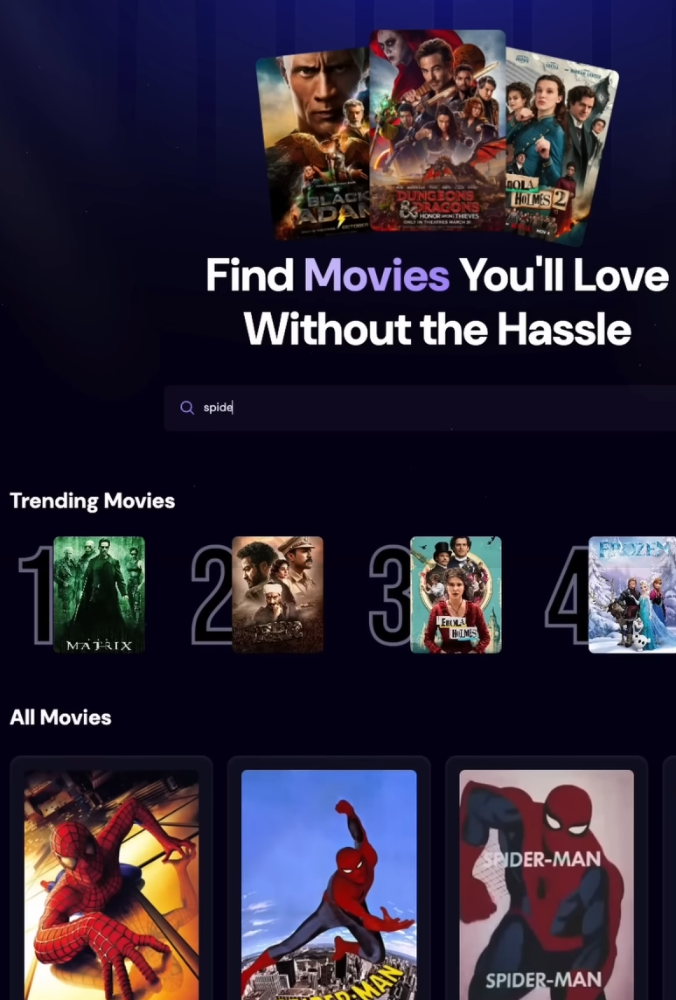

# Movies with API and APPWRITE database

To make this really nice project, I have followed a youtube video to learn about how the library/framework react.js works. 

## Links to what I used to make this project.

- [https://react.dev/] library/framework that was the primary learning goal in this project
- [@vitejs/plugin-react](https://github.com/vitejs/vite-plugin-react/blob/main/packages/plugin-react/README.md) uses [Babel](https://babeljs.io/) for Fast Refresh
- [@vitejs/plugin-react-swc](https://github.com/vitejs/vite-plugin-react-swc) uses [SWC](https://swc.rs/) for Fast Refresh

- [https://appwrite.io/] to handle the cloud database (You can have one free database per account)
- [https://www.npmjs.com/package/use-debounce] package to optimaze search function
- [https://tailwindcss.com/] To style the webpage.
- [https://www.youtube.com/watch?v=dCLhUialKPQ&t=7482s] the youtube video I followed
- [https://developer.themoviedb.org/reference/intro/getting-started] For movies api call (You need to have a API Key, but it is FREE, you only need to create a account)
- [https://www.npmjs.com/] and [https://nodejs.org/en] to create the project by npm commands (Node Package Manager)
## Images of how the webpage looks



## Follow these steps to set up the project locally on your machine.

**Prerequisites**

Make sure you have the following installed on your machine:

- [Git](https://git-scm.com/)
- [Node.js](https://nodejs.org/en)
- [npm](https://www.npmjs.com/) (Node Package Manager)

**Cloning the Repository**

```bash
git clone https://github.com/jacobbokaj/movies-react-app.git
```

**Installation**

Install the project dependencies using npm:

```bash
npm install
```

**Set Up Environment Variables**

If you want to do it the visuel way and use a guide. Go to this youtube video with timestamp [https://www.youtube.com/watch?v=dCLhUialKPQ&t=5948s] else then<br>
Create a new file named `.env.local` in the root of your project and add the following content:

```env
VITE_IMDB_API_KEY=

VITE_APPWRITE_PROJECT_ID=
VITE_APPWRITE_DATABASE_ID=
VITE_APPWRITE_COLLECTION_ID=
```

**Running the Project**

```bash
npm run dev
```

Open [http://localhost:5173](http://localhost:5173) in your browser to view the project.
